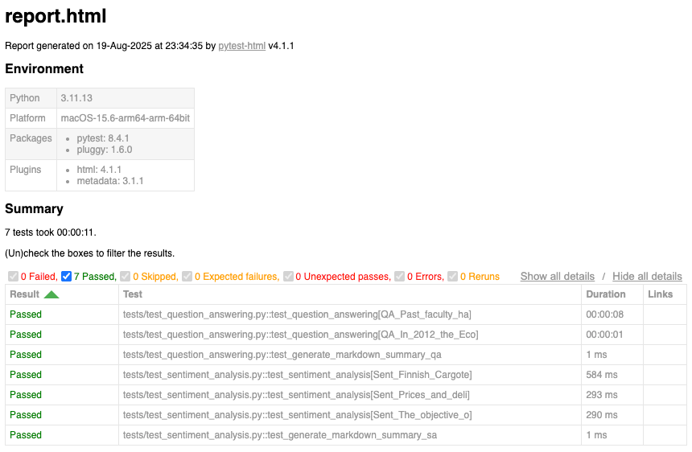

# Hugging Face AI Models Evaluation Dashboard

This project demonstrates **automated evaluation of AI models from Hugging Face**, designed as part of an AI portfolio to showcase expertise in model benchmarking, performance analysis, and inference pipelines. 
It allows you to systematically run model predictions on benchmark datasets, evaluating performance with standard metrics (e.g., accuracy, precision, recall, F1-score, exact match), and generating detailed reports for analysis and comparison.

# 🚀 Features

## 🔗 Hugging Face Model Evaluation
- Exposes Hugging Face pretrained models as APIs using FastAPI. 
- Supports local inference via the Transformers library.
- Evaluate multiple models across standard AI tasks:
  - **Question Answering** → SQuAD-style data
  - **Sentiment Analysis** → financial domain data  
- Configurable model selection via `config.yml` or `HF_TOKEN` environment variable.  

## 📂 Test Data Support
- **Question Answering**  
  - Model: [`deepset/roberta-base-squad2`](https://huggingface.co/deepset/roberta-base-squad2)  
  - Dataset: **SQuAD 2.0** ([link](https://rajpurkar.github.io/SQuAD-explorer/))  
  - Includes both **answerable** and **unanswerable** questions.  
- **Sentiment Analysis**  
  - Model: [`distilbert/distilbert-base-uncased-finetuned-sst-2-english`](https://huggingface.co/distilbert/distilbert-base-uncased-finetuned-sst-2-english)  
  - Dataset: **Financial Sentiment Analysis** from Kaggle ([link](https://www.kaggle.com/datasets/sbhatti/financial-sentiment-analysis))  
  - Labeled examples for **positive**, **negative**, and **neutral** financial sentiment.  

## 📊 Model Evaluation
Evaluation is performed with task-appropriate metrics:

- **Question Answering**
  - **Exact Match** → measures the percentage of predictions that match the ground truth exactly  
  - **F1 Score** → measures word overlap between prediction and ground truth (more forgiving than EM)  

- **Sentiment Analysis**
  - **Accuracy** → fraction of correctly classified samples  
  - **Precision** → proportion of positive identifications that were correct  
  - **Recall** → proportion of actual positives correctly identified  
  - **F1 Score** → harmonic mean of precision and recall  

## 📝 Custom Reports
- Saves all model outputs in `artifacts/` for reproducibility.  
- Generates detailed reports:
  - **HTML Report** → `reports/report.html`
  - **JUnit XML Report** → `reports/junit.xml`
  - **Markdown Summaries** → `reports/summary_qa.md`, `reports/summary_sa.md`  
- Reports include **per-sample evaluations** (perdictions with metrics) and **summary statistics** across the dataset. 

## FastAPI + Containerization
- **FastAPI App:**  
  - The pretrained AI model is wrapped with FastAPI, exposing a REST API endpoint at `POST /predict`.
- **Dockerized Deployment:**  
  - The service is containerized using a `Dockerfile`.
  - A `docker-compose.yml` configuration is provided for easy setup and orchestration.
- **CI Integration:**  
  - The GitHub Actions workflow builds and runs the Docker image.
  - The FastAPI application is launched inside the test container.
  - Automated tests are executed within the same container for consistency and isolation.

## Streamlit Dashboard + Visualization
- **Streamlit App:**  
  - A Streamlit dashboard visualizes test reports and evaluation metrics.
- **Live Report Updates:**  
  - The CI workflow pushes newly generated test reports to the `main` branch.
  - The Streamlit app always reflects the latest test data by pulling updated reports from the repository in real time.

## ⚙️ Configuration & Extensibility
- Easily configurable via `config.yml` and environment variables.  
- Supports optional model parameters (e.g., `temperature`, `max_tokens`).  
- Designed for extensibility:
  - Add new tasks  
  - Plug in different models or datasets  
  - Define custom evaluation metrics  

## Continuous Integration (CI)
This project uses a **GitHub Actions CI workflow** that runs all tests inside Docker containers for reproducibility and isolation.  
The workflow builds the test image, runs the test suite, and automatically uploads and commits reports.

### Workflow Status


### 🔄 Workflow Triggers
- **Push events** on all branches
- **Pull requests** targeting `main`

### 🛠️ Job: `build-test-report`
Runs on **Ubuntu (latest)** with Docker-in-Docker enabled. Steps include:

1. **Checkout Repository**
   - Uses [`actions/checkout`](https://github.com/actions/checkout) to clone the repository.

2. **Set up Docker Buildx**
   - Uses [`docker/setup-buildx-action`](https://github.com/docker/setup-buildx-action) for advanced Docker builds.

3. **Build and Run Test Container**
   - Builds the `test` image via Docker Compose.
   - Runs all tests inside the container (`docker compose up --abort-on-container-exit test`).

4. **Clean up Docker Resources**
   - Removes unused Docker resources to keep the runner clean.

5. **Upload Artifacts**
   - **JUnit XML report** → `reports/junit.xml`
   - **HTML test report** → `reports/report.html`
   - **Markdown summaries** → `reports/summary_qa.md`, `reports/summary_sa.md`

6. **Commit and Push Reports**
   - Automatically commits updated reports in the `reports/` directory back to the `main` branch.

### 🔐 Environment Variables
- **`HF_TOKEN`**: Required Hugging Face access token (stored securely in GitHub Secrets).

### 📊 Test Reports
After the workflow completes, you can download artifacts directly from the **GitHub Actions run summary**:
- Open the workflow run → scroll down to **Artifacts** → download reports.

## Requirements
- Python 3.11
- A Hugging Face token with Inference API access (set `HF_TOKEN`)

## Quickstart
1. Set your token:
   - macOS/Linux:
     ```bash
     export HF_TOKEN=hf_xxx_your_token_here
     ```
   - Windows PowerShell:
     ```bash
     $env:HF_TOKEN="hf_xxx_your_token_here"
     ```
2. Install Python 3.11 using Homebrew:  
     ```bash
     brew install python@3.11
     ```   
3. Create virtual environment and install dependencies:
   ```bash
   python3.11 -m venv .venv
   source .venv/bin/activate
   pip install -r requirements.txt
   ```
4. Launch FastAPI app:
   ```bash
   uvicorn apiapp:app --reload --host 0.0.0.0 --port 8000 
   ``` 
5. View built-in UI Interface of FastAPI:
   ```bash
   http://localhost:8000/docs 
   ```  
   Or
    ```bash
   http://localhost:8000/redoc
   ``` 
6. Run tests:
   ```bash
   pytest 
   ```
7. View results:
   - Open `reports/report.html` for the HTML report
   - Check `reports/summary_qa.md`, `reports/summary_sa.md` for the Markdown summary reports
   - API outputs are saved in `artifacts/`

8. Launch Streamlit dashboard app:
   ```bash
   streamlit run streamlitapp.py --server.port 8501 
   ```  
9. View Streamlit dashboard:
   ```bash
   http://localhost:8501/
   ```    

## 📊 Test Reports
- **HTML Report:**



- **Markdown Summary Report:** 


       